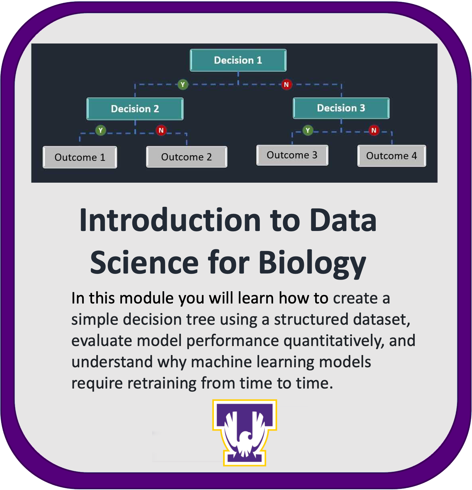

# Introduction to Data Science for Biology
## San Francisco State University   

<br>
<p align="center">
    
</p>

## Contents

+ [Overview](#overview)
+ [Getting Started](#getting-started)
+ [Tutorial](#Tutorial)
+ [Data](#data)


## **Overview**

This module is geared towards beginners and does not require prior knowledge on a specific scientific discipline. The module is divided into three Jupyter notebooks as outlined at the beginning of this document. In addition to the notebooks mentioned, there are videos containing brief explanations about basic concepts in machine learning and what the code does in each step of the notebook. Below is an outline of the videos contained in each notebook with their respective links. These videos are already attached to the notebook.

This module offers two computing pathways: [AWS (Amazon Web Services)](https://github.com/NIGMS/Introduction-to-Data-Science-for-Biology/tree/master/AWS) or [GCP (Google Cloud Platform)](https://github.com/NIGMS/Introduction-to-Data-Science-for-Biology/tree/master/GoogleCloud). Users can choose their preferred cloud service to run the Jupyter notebooks, ensuring flexibilty and accessibilty based on their existing infrastructure or familairty. Detailed instructions for setting up and using either AWS or GCP for this module are provided within their corresponding folders within this repository. 

## 1- Introduction To Machine Learning: Decision Trees 
## 1.0 Module Overview

### 1.1 Purpose and Learning Objectives

The primary purpose of this module is to familiarize beginners with fundamental machine learning concepts by applying them to a practical health data challenge. Using a structured COVID-19 dataset, the module provides a step-by-step walkthrough of how to create, interpret, and evaluate a **Decision Tree** model.

By the end of this tutorial, you will be able to:

* **Understand** the core concepts of a supervised learning workflow.
* **Create and train** a Decision Tree model using Python.
* **Make predictions** on new data using the trained model.
* **Interpret** the model's logic by visualizing the decision tree.
* **Evaluate** model performance intuitively.
* **Grasp** why machine learning models require periodic retraining to remain accurate.

### 1.2 Structure of the Jupyter Notebooks

This learning module is divided into several Jupyter notebooks, each serving a specific purpose in your learning journey:

* `1- Introduction To Machine Learning: Decision Trees`: This is the core instructional notebook. It provides a basic introduction to machine learning concepts and guides you through creating, understanding, predicting with, and evaluating a Decision Tree model.
* `2- (Optional) Quant. Comparison of 2020 DT Model Performance for (2020 vs 2021) Data`: This optional notebook offers a more advanced look at quantitative model evaluation. It also introduces the critical concept of why machine learning models require periodic retraining.
* `3- Practice Exercise`: This notebook gives you an opportunity to practice and test what you have learned from the first notebook. It provides basic instructions for you to apply the concepts by modifying existing code or writing your own.
* `4- Practice Exercise - Answer Key`: This notebook contains the complete answers and explanations for the practice exercise. It is best used as a reference *after* you have attempted the exercise on your own.

---

## **Getting Started**
Before you can begin the tutorial, you must set up a computational environment to run the Jupyter notebooks. This module supports two major cloud platforms: **Amazon Web Services (AWS)** and **Google Cloud Platform (GCP)**.

### 2.1 Choose Your Cloud Platform

Follow the instructions below for your chosen platform.

#### 2.1.1 Google Cloud Platform (GCP)

1.  Begin by following the detailed setup guide located in the `GoogleCloud` folder of the repository.
2.  As directed by the guide, create a new user-managed notebook in **Vertex AI Workbench**, ensuring you select the configurations outlined in the setup guide.
3.  Finally, clone the repository into your Vertex AI notebook using the following Git command:

    ```bash
    git clone [Your Repository URL Here]
    ```

#### 2.1.2 Amazon Web Services (AWS)

1.  Begin by following the detailed setup guide located in the `AWS` folder of the repository.
2.  As directed by the guide, create a new Jupyter notebook instance in **Amazon SageMaker**, ensuring you select the configurations outlined in the setup guide.
3.  Finally, clone the repository into your SageMaker notebook using the following Git command:

    ```bash
    git clone [Your Repository URL Here]
    ```

> **For more detailed guidance**, please refer to the specific instructions located within the `AWS` or `GoogleCloud` folders in the cloned repository.


## **Tutorial**
 We will use data from the summer of **2020** to train a Decision Tree to predict COVID-19 case rates in California counties.


###  [Step 1: Importing necessary packages into Google Colab](https://youtu.be/jPIQbpdTkbM)

The first strategic step is to import the necessary packages—the **tools needed to build our model**.

* `pandas` and `numpy`: Essential for data handling, manipulation, and mathematical operations.
* `sklearn` (scikit-learn): A very popular Python package for machine learning. We specifically import `DecisionTreeRegressor` to build our model.
* **Visualization libraries**: Tools for evaluating our model and visualizing the final decision tree.

> In a Jupyter notebook, text following a hashtag (`#`) are **comments**—notes that explain the code but are ignored by the computer.

### [Step 2: Loading training data and making sure it looks correct](https://youtu.be/z9dcLYg65uk)

Next, we load the data that will be used to "teach" our model, called **training data**. For this project, our training data consists of the first 40 rows (counties) from our dataset.

We load the data from a **CSV (Comma Separated Values)** file. Once loaded, we inspect it using simple commands:

* Displaying the full data frame: Prints the entire table.
* `.head()`: Lets us "take a peek" at just the **first five rows** to quickly check the data structure.
* `.shape()`: Checks the **dimensions** of our data (e.g., 40 rows and 11 columns).

### [Step 3: Separate the training dataset into features and labels](https://youtu.be/qh8C0QRECWU)

In supervised learning, we separate the data into two distinct parts:

* **The Label (Target)**: The single column we want our model to predict. In our case, this is **cases per 100,000** people.
* **The Features**: All the other columns the model will use to make that prediction (e.g., population size, unemployment rate, election data).

This step partitions our data, which we then verify by checking the dimensions of the new data frames (e.g., 40 rows for both, but 1 column for the label and 9 for the features).

### [Step 4: Create a decision tree object and train it](https://youtu.be/M6gY_JywOys)

This step represents the core "learning" phase and is accomplished with just a few lines of code:

1.  **Create the tree "object"**: This builds an empty model based on basic specifications.
2.  **Train the model**: A simple line of code feeds the **features** and the **label** into our tree object. The computer analyzes the data and learns the rules that connect the features to the label.

### [Step 5: Visualize our trained decision tree](https://youtu.be/cFk6vmfU48w)

Visualizing the model is crucial for understanding what it has learned. The resulting diagram is a **flowchart of decisions**.

| Component | Description |
| :--- | :--- |
| **Node** | A point in the tree that contains a decision (e.g., "Is the unemployment rate $\le 0.123$?"). |
| **Leaf** | An endpoint that contains no further decisions; it represents a **final outcome or prediction**. |
| **Root Node** | The node at the very top. It represents the single **most important feature** that best splits the data (for 2020, this is the **unemployment rate**). |
| **Decision Flow** | If the criterion is met (**True**), the path moves **left**. If not met (**False**), the path moves **right**. |
| **Samples** | The number of the original 40 counties present at that point in the tree. |
| **Value** | The estimated number of COVID cases per 100,000 people. The final value in a leaf is the model's prediction. |

### [Step 6: Make predictions using testing data with our trained decision tree](https://youtu.be/LtD93dB5JzU)

The true test is the model's ability to make accurate predictions on new, unseen **testing data** (in this case, 18 different counties).

1.  **Load the testing data.**
2.  **Prepare the data**: The testing data must only contain **feature columns**.
3.  **Generate predictions**: A single line of code runs the prepared testing data through the trained model, generating a predicted case rate for each county.

All predictions generated by the model will be one of the values shown in the **leaves** of the visualized tree.

### [Step 7: Evaluating the decision tree model performed](https://youtu.be/0VK4sLz2wrc)

The final step is to compare the model's **predicted values** against the **actual, real-world values** for the same counties.

1.  Load the actual labels for the 18 testing counties.
2.  Create a **bar graph** that displays the predicted value (orange bars) and the actual value (dark blue bars) side-by-side for each county.

We observe that the predictions are not perfect, but the model performed relatively well overall, with some counties (like Contra Costa and San Francisco) having very close predicted and actual values, and others (like Mono and Calaveras) showing poor performance.

---

## 4.0 Advanced Concept: Model Timeliness and Retraining

A critical concept is that models are a product of the data they are trained on—a **snapshot in time**. This section explores what happens when a model trained on old data (2020) is used to predict outcomes in a new period (2021).

### [Let's try using our summer 2020 tree model to predict 2021 data](https://youtu.be/2r3ZpwM6xDQ)

We use our 2020-trained Decision Tree to predict COVID-19 cases using feature data from **summer 2021**.

The results are striking: **the model did not work very well**. When visualized, the predictions (yellowish orange bars) are almost all much **lower** than the real numbers (darker greenish bars). The model's learned patterns from 2020 are no longer relevant to the 2021 reality.

### 4.2 Building a New Model with 2021 Data

The solution is to **retrain** the model using 2021 data. This is done by re-using the existing code, simply updating the file names and variables from `2020` to `2021`.

After the new model is trained, a key difference emerges: **the root node has changed**.

* **2020 Model Root Node**: **Unemployment rate** (socioeconomic factors were the strongest predictors).
* **2021 Model Root Node**: **Fully vaccinated percentage** (the availability of vaccines became the dominant factor).

A side-by-side comparison of the results makes the improvement clear:

| 2020 Model on 2021 Data | 2021 Model on 2021 Data |
| :--- | :--- |
| Chart reveals **significant under-prediction**. Most predicted values (yellow bars) are drastically lower than the actual case numbers (green bars). | Chart shows a **strong alignment** between predicted and actual values. The bars are much closer in height, demonstrating a more accurate and useful predictive tool. |

### 4.3 Key Takeaways on Model Maintenance

This exercise provides crucial lessons about deploying and maintaining machine learning models:

1.  **Models Reflect Their Training Data**: A model's predictive power is tied to the patterns present in the data it was trained on.
2.  **The World Changes**: Real-world conditions evolve (e.g., the introduction of vaccines), and old patterns can become obsolete.
3.  **Retraining is Essential**: When the underlying drivers of an outcome change, models must be retrained with new, relevant data to maintain their accuracy and usefulness.
4.  **Generalization is Not Guaranteed**: A model that performs well in one context (e.g., one year) may not work well in another.


### 2-  (Optional) Quant. Comparison of 2020 DT Model Performance for (2020 vs 2021) Data

### 3-  Practice Exercise ( 1 video clip)
- [Walkthrough Solution](https://youtu.be/eHI4wMjSGuU)
### 4- Practice Exercise - Answer Key (1 video clip )
- [Walkthrough Solution](https://youtu.be/eHI4wMjSGuU)

This module teaches you how to create a simple Decision Tree using a structured dataset. In addition to the overview given in this README you will find the four Jupyter notebooks. The second notebook is optional.

- **1- Intro to Machine Learning: Decision Trees**: This notebook provides a basic introduction to Machine Learning concepts, steps for creating and understanding a Decision Tree model, making predictions with it, and intuitively evaluating its performance. 

- **2- (Optional) Quant. Comparison of 2020 DT Model Performance for (2020 vs 2021) Data**: This notebook is optional, for students who would like to know a bit more about how to evaluate model performance quantitatively, and offers an introduction to why machine learning models require retraining from time to time. 

- **3- Practice**: This notebook provides a way to practice and test what you have learned from the first notebook. It includes basic instructions outlining every step discussed in the first notebook. Students are free to either copy and modify the code from the first notebook or they can choose to write it themselves.

- **4- Practice - Answer Key**: This notebook provides the answers and explanation to the previous Practice exercise notebook. Check this notebook only after you have tried to complete the previous exercise yourself. 


    
    
## **Data** 

All original data from this module was originally sourced from the following sites: 

- [COVID cases data (California Health and Human Services Agency)](https://data.chhs.ca.gov/dataset/covid-19-time-series-metrics-by-county-and-state/resource/046cdd2b-31e5-4d34-9ed3-b48cdbc4be7a)
- [COVID vaccination data (Los Angeles Times)](https://github.com/datadesk/california-coronavirus-data)
- [Unemployment data (California Employment Development Dept.)](https://labormarketinfo.edd.ca.gov/data/unemployment-and-labor-force.html)
- [Election data (Harvard University)](https://dataverse.harvard.edu/dataset.xhtml?persistentId=doi:10.7910/DVN/VOQCHQ)


